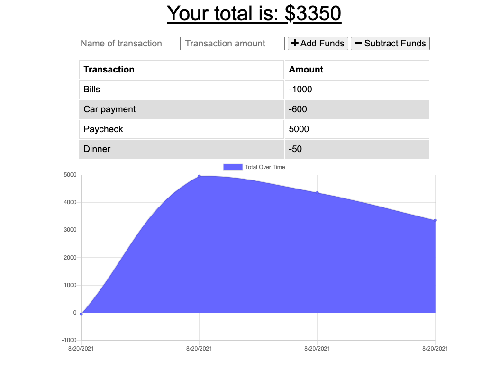

# BudgetTracker

Added functionality to an existing Budget Tracker application to allow for offline access and functionality.

## Deployed Link
This Budget Tracker web app can be found deployed on heroku here: https://budget-tracker-hk.herokuapp.com

## User Story

AS AN avid traveller

I WANT to be able to track my withdrawals and deposits with or without a data/internet connection

SO THAT my account balance is accurate when I am traveling

## Business Context

Giving users a fast and easy way to track their money is important, but allowing them to access that information anytime is even more important. Having offline functionality is paramount to our applications success.

## Acceptance Criteria

GIVEN a user is on Budget App without an internet connection

WHEN the user inputs a withdrawal or deposit

THEN that will be shown on the page, and added to their transaction history when their connection is back online.

## Status of Application
Users are able to track their budget whether they have an active internet connection or not.

## Example Image

## License
  
This project is covered under the MIT license.

## Contributing
Harrison Kidd 

## Questions
Contact me with any questions here: [harrisonakidd@gmail.com](mailto:harrisonakidd@gmail.com)